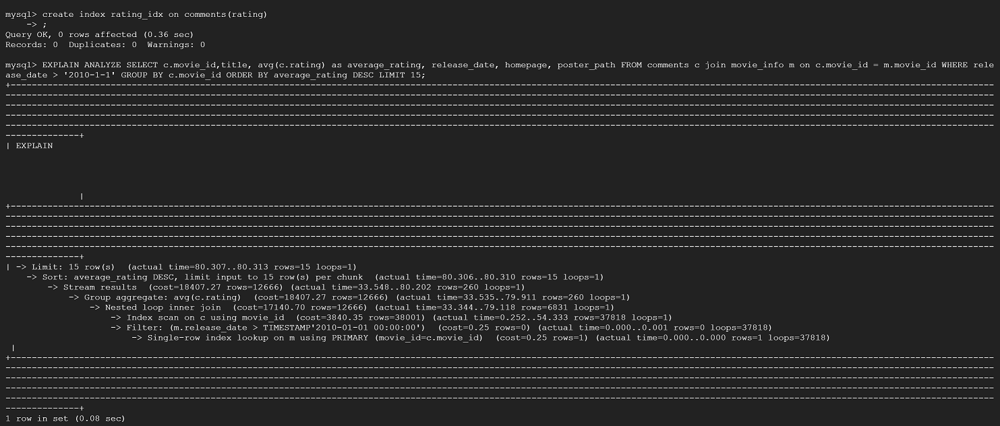

# Database Design

## Database implementation
### GCP connection

### Data Definition Language (DDL) commands for tables
```
CREATE TABLE movie_info(
    movie_id INT NOT NULL,
    title VARCHAR(50),
    imdb_id VARCHAR(15),
    release_date DATETIME,
    overview VARCHAR(255),
    tagline VARCHAR(255),
    homepage VARCHAR(255),
    poster_path VARCHAR(255),
    popularity REAL,
    revenue INT,
    PRIMARY KEY (movie_id)
);

CREATE TABLE account_info(
    userID INT NOT NULL,
    account_name VARCHAR(20),
    account_passwd VARCHAR(255),
    age INT,
    account_type INT,
    tag1 INT,
    tag2 INT,
    tag3 INT,
    PRIMARY KEY (userID)
);

CREATE TABLE comments(
    comment_id INT NOT NULL,
    userID INT NOT NULL,
    movie_id INT NOT NULL,
    rating REAL,
    adding_date DATETIME,
    msg VARCHAR(255),
    PRIMARY KEY (comment_id),
    FOREIGN KEY (userID) REFERENCES account_info(userID),
    FOREIGN KEY (movie_id) REFERENCES movie_info(movie_id)
);

CREATE TABLE watch_list(
    watch_id INT NOT NULL,
    movie_id INT NOT NULL,
    userID INT NOT NULL,
    watch_add_date DATETIME,
    PRIMARY KEY (watch_id),
    FOREIGN KEY (userID) REFERENCES account_info(userID),
    FOREIGN KEY (movie_id) REFERENCES movie_info(movie_id)
);

CREATE TABLE genre(
    genre_id INT NOT NULL,
    genre_name VARCHAR(20),
    PRIMARY KEY (genre_id) 
);

CREATE TABLE movie_genre(
    movie_id INT NOT NULL,
    genre_id INT NOT NULL,
    PRIMARY KEY (movie_id,genre_id),
    FOREIGN KEY (genre_id) REFERENCES genre(genre_id),
    FOREIGN KEY (movie_id) REFERENCES movie_info(movie_id)    
);

```
### Insert data

## Advanced Queries
### Advanced Queries 1
```
-- compute average rating for different movies 
SELECT c.movie_id,title, avg(c.rating) as average_rating, release_date, homepage, poster_path
FROM comments c join movie_info m on c.movie_id = m.movie_id
WHERE release_date > '2010-1-1'
GROUP BY c.movie_id
ORDER BY average_rating DESC
LIMIT 15
```

### Advanced Queries 2
```
--compute numbers of comments with rating more than 2 for each user
SELECT account_info.userID, account_name, COUNT(movie_id) AS NumMov
FROM account_info LEFT OUTER JOIN comments ON account_info.userID = comments.userID
WHERE account_name LIKE "B%" and comments.rating >= 2 
GROUP BY account_info.userID
ORDER BY NumMov DESC
LIMIT 15;
```

## Indexing Analysis
### Advanced Queries 1

```
create index adding_date_idx on comments(adding_date)
```

We know that adding_date is not related to this query, and we can see that the performance is worse than  the original performance. Because we need extra time to set indexing which we do not use in this query.

```
create index rating_idx on comments(rating)
```

Firstly we add index of rating from comments table because we want to compute the average ratings for each movies, but the add of indexing does not have good effect on the overall performance. we can see that index scan on c becomes 54.33 in upper bound and the nested loop inner join has become 33.344-79.9118 which is much slower compared with 0.325-25.665 in the original index setting. And we also see that the overall generating time reaches 0.08 second slower than 0.04 second. We guess it might because we do average operation and use ratings attribute after doing inner join operation. There is no need to firstly give index to ratings and it will waste time in the join operation.
```
create index release_date_idx on movie_info(release_date)
```

Then we drop rating_idx because it will harm overall performance. We add attribute release date index. It have good effect on overall performance. We can see from the result, the filter time has been reduced to 0.002 instead of 0.1..5.419 in the original indexing mode. Because we will do filter operation by "where" command and using this index can search the release date later than 2010 faster.

### Advanced Queries 2

```
create index name_idx on account_info(account_name)
```

Because we want to find people whose name start with 'B', we make index for their names which can make filter names time shorter. However, the overall time is not saved, and also the filter time for account name starting with "B" do not change , loops are still 35664. We think it is becasue for these two excuting stragey, they all go through all loops to find userID so that there is no difference between two operations.
```
create index rating_idx on comments(rating)
```

Because we want to make teh process of searching for rating more than 2 shorter we make rating index to comments table. The performance is better than the original query. We can see from the report, after filter for rating more than 2 in comments table, it uses index range scan on comments using rating_idx instead of table scan. The rows scan is less than original one for 19000 rows. However, the cost is not less and the time is a bit shorter than the original design. We think it is probably because we need cost to use index and this index does not help overall query performance much.
```
create index name_idx on account_info(account_name)
create index rating_idx on comments(rating)
```

We try to add this two attribute indexing and find that unsurprisingly, there is not much better effect on the overall performance on the whole design. The time we use to aggregate tables seems longer than original design. We think it is because the extra indexing we add do not have positive effect on the design but lead to extra time cost to reach the attribute we want.

