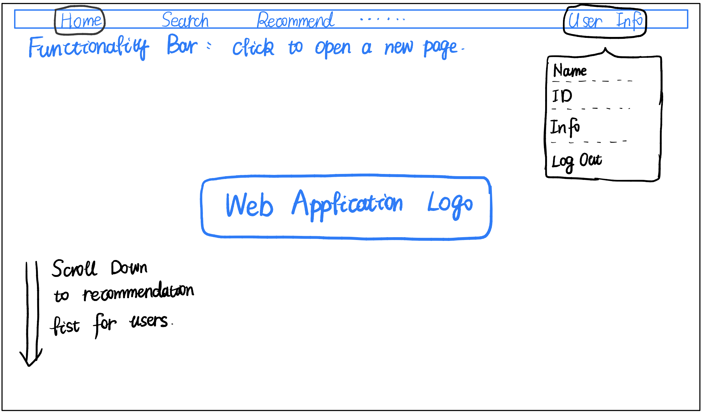
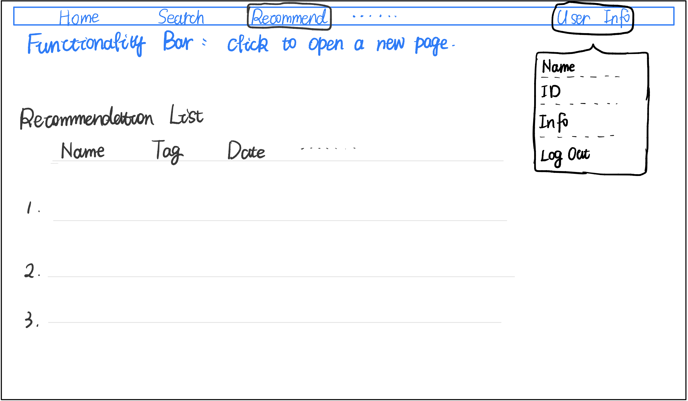

# Project Proposal

- team033-Key of Sky

## Title

**uMovies**

## Summary
In this project, we aim to create a platform where Movie lovers can easily find movies they like. It is an online database of information mainly related to films, including 45000 movie lists and almost cover all varieties of film genres. Based on user features, eligible films movies will be recommended to them automatically by our system and we also provide them with watchlist to record what they want to watch. If users click on the results of movies searching, they can see basic information of movies, including movie posters, rating information, genres, releasing data and so on.

Our platform also provide a friendly communication environment and relatively fair rating system for movie lovers. Users can exchange their thoughts toward movies freely and other users can see it. Users can write comments, those comments will be saved in our database and users can also find their old comments. 

## Description
Our platform can not only help users find what they want to watch, but also give them our recommendations based on user features. The functionality of our system is comprehensive, when users cannot decide which one to watch, the rating system and comments which most of websites do not have can also help them to decide. Apart from this, compared with IMDb, our platform UI is clearer and more attractive which can easily guide users to reach correct functional partitions. Our platform provides users convenience by providing information about movies when they want to watch movies in their free time.

## Usefulness
The website helps people to find the information about movies and gives them movie recommendations based on their preference. The idea is motivated by imdb.com, however, this website is simplified, and people can see all aspects of the film more visually without being distracted by advertising. The data source for the recommendation system is the preference tags entered by the user during registration. People can freely add comments and add information about any new movies.

## Realness
The data originate from the Full MovieLens Dataset which contains metadata for all 45,000 movies listed in the Full MovieLens Dataset. The dataset consists of movies released on or before July 2017. Data points include cast, crew, plot keywords, budget, revenue, posters, release dates, languages, production companies, countries, TMDB vote counts and vote averages.This dataset also has files containing 26 million ratings from 270,000 users for all 45,000 movies. Ratings are on a scale of 1-5 and have been obtained from the official GroupLens website.

## Functionality
Our application collects various movies and allow user to search, rate and so on.

**Data sourse**

Kaggle Datasets The Movies Dataset: https://www.kaggle.com/datasets/rounakbanik/the-movies-dataset .
And other datasets maybe.

**Main tables and attributes: (just a sample)**

Account_info:   account_id, account _name, account _pwd, age, account_type, tag …
Movie_info:     movie_id, title, release_time, genre, poster_url, imdb_id, homepage, overview …
Rating_info:    record_id, account_id, movie_id, rate, time …
Genre_info:     genre_id, genre_name, num_movies, avg_rate …

NOTES: 
Every account has its own account type which is user or administrator. Administrator has higher authority and can do more operations than a normal user, for example, he/she can add new movies, update information of movies, and even delete some movies.
The tag attribute indicates user’s preferred genres of movies. It is used when do recommendation and can be updated by user self.
To provide better experience to users, we plan to display the posters of movies in some pages. The poster info stored in the database would be links, and we need to visit the link and display the poster on the frontend side.

**Operations:**

Creating:
1.	Users need to create a new account to unlock full functionality such as rating, advanced search, auto-recommending. 
2.	Administrator can create new records of new movies into database.
3.	Users can rate movies, i.e., the rating records will be created and stored.

Deleting:
1.	Users can drop the account if want. Then all information related to this account, such as rating records, will be deleted. To do that referential‐integrity constraints are needed.
2.	Administrator can delete movies in some cases.
3.	Users and administrator can delete rating records.

Updating:
1.	Users can update their information, such as the preferred movie tags to get more recommended movie with different genres.
2.	Administrator can update information of movies in some cases.
3.	To avoid malignant rating, we restrict that every user can only rate once for the same movie, but the user can update it.

Searching:
1.	Users can search movies by title, or filter by genres, release time of movies and so on.
2.	Administrator can see and search information of accounts.
3.	Users can search the rating records related a specific movie.
4.	Users can manually refresh the recommendation list to get new movies. We search movies according to the tag of the user.

Statistic:
1.	Users can see the statistics of movies and rating records, such as the number of movies in different genres, the distribution of rating about a specific movie or movies with the same genre. 
2.	The statistics of accounts are visible to administrator. 
*Aggregation is needed for statistics.

**Potential relationships:**

1.	Every id is unique. One account id is corresponding to one account. One rating id is corresponding to one rating record. (One to one)
1.  Every user can submit one rating record for one movie but multiple rating records for different movies. (One to one, one to many)
2.  One movie can have various genres, every genre class has many movies. (One to many)
Every user can choose various preferred genres. So, the recommendation is a map from various genres to multiple movies. (One to many, many to many)
4.  The filters should handle multiple filtering condition and return multiple records meeting the conditions at the same time. (Many to many)

## UI Mockup

## Project Work Distribution

- **Frontend** : Keyi, Guanshujie
- **Backend** : Haina, Xiaomin
- **SQL Schema** - Haina, Xiaomin
- **Fethching data** - Keyi
- **Basic SQL queries** : Everyone individually as there are many
- **Advanced SQL queries** : Everyone in pairs of two
- **GCP setup and hosting** : Guanshujie
